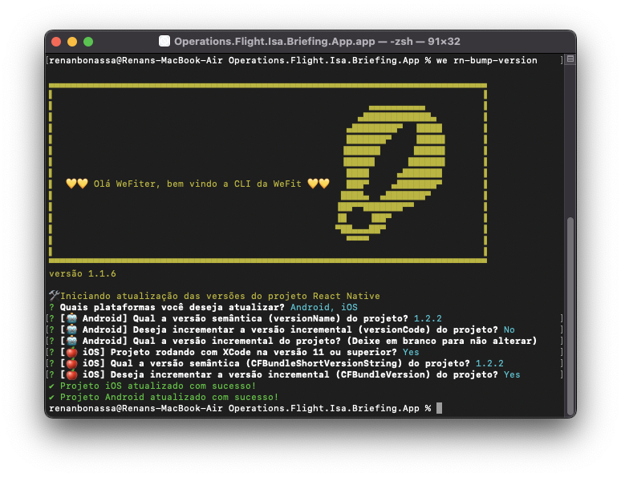

# WeFit CLI

Ferramenta desenvolvida pela WeFit para auxiliar nossos TechDesigners.

## Instalação

- Instalar no npm global com o seguinte comando:

```bash
npm install -g wefit-cli
```

- Testar a instalação chamando a CLI:

```bash
we
```


## Comandos

### Ajuda

Para verificar os possíveis comandos

```bash
we -h
```


### Tradução

Para rodar os comandos de tradução é preciso estar no mesmo nível da pasta locales

- **translation-export**: Exporta os arquivos da pasta locales para xlsx
- **translation-import**: Importa a planilha de tradução

### Figma

- **figma-generate**: Executa a exportação do DS e gera os arquivos no local da execução do comando:

  - /assets/icons/config.json

  ### Ao executar o comando abaixo você vai precisar inserir dois token prompt:

  ```bash
  we figma-generate # we fg
  ```

  - Token de usuário do Figma, que pode ser gerado aqui:
    
    

  - ID do arquivo do Figma, você pode pegar na url logo após o *www.figma.com/design/*
    

  ### Atualizando a lista de tipagem de nomes dos ícones

  Após executar a importação do figma e ter seu config.json atualizado é preciso seguir os seguintes passos:

  - Adicionar em seu `package.json` o script:

  ```
  "update:icon": "node caminho/para-o-arquivo/generateIconType.js"
  ```

  - Executar `npm run update:icon`

  Você encontra o script `generateIconType.js` e o componente React que renderiza ícones a partir do `icon/config.json` [aqui](./templates/Icon/)

### Credencial Devops

Para executar o comando de atualização de credencial, você pode estar em qualquer parte do sistema.

- **set-git-credential**: Seta a nova credencial para o repositório

```bash
we set-git-credential sua_nova_credencial # we sgc sua_nova_credencial
```

A partir desse comando, será solicitado o _path_ do repositório que deverá ser atualizado e o que você quer fazer, executar o comando ou copiar para a área de transferência.


### VS Code Extensions

- **vscode-extensions**: Instala as extensões para VS Code recomendadas pela WeFit.

```bash
we vscode-extensions # we ve
```


### Atualizar versão do projeto React Native

Este comando facilita a atualização da versão dos projetos react native nos ambientes nativos (Android e iOS) para mais informações sobre esse fluxo acesse a documentação em [link da doc](https://www.notion.so/WIP-Controle-de-vers-es-no-React-Native-19279887e7e54f99b468fbfb9aeb7ae3)



## Templates

Abaixo a lista de templates.

- [Componente de ícone icon/config.json - React](./templates/Icon/)

## Como contribuir 🤝

- [Veja como colaborar com esse projeto](./CONTRIBUTING.md)

---

<p align="center">
  <a href="https://wefit.com.br/">
    
  </a>
  <p align="center">
    Construído e mantido pela <a href="https://wefit.com.br/">WeFit | Digital Service Design</a>.
  </p>
</p>