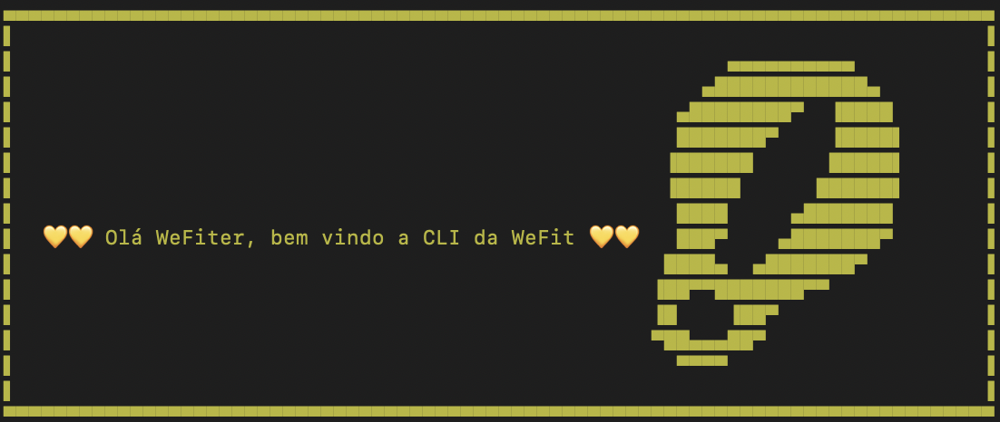
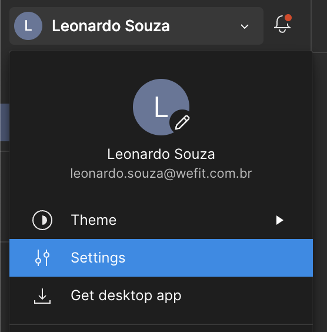
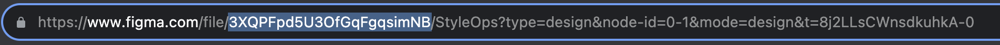

# WeFit CLI

Ferramenta desenvolvida pela WeFit para auxiliar nossos TechDesigners.

## Instalação

- Clonar o projeto
- Instalar no npm global com o seguinte comando:

```bash
npm run refresh
```

- Testar a instalação chamando a CLI:

```bash
we
```



## Comandos

### Tradução

Para rodar os comandos de tradução é preciso estar no mesmo nível da pasta locales

- **translation-export**: Exporta os arquivos da pasta locales para xlsx
- **translation-import**: Importa a planilha de tradução

### Figma

- **figma-generate**: Executa a exportação do DS e gera os arquivos no local da execução do comando:

  - /styles/config.json
  - /styles/global-styles.css
  - /assets/(arquivos-das-logos).svg
  - /assets/icons/config.json
  - /assets/icons/(groupo-de-icones)/(nome-do-icone).svg

  ### Ao exucetar o comando abaixo você vai precisar inserir dois token prompt:

  ```bash
  we figma-generate
  ```

  - Token de usuário do Figma, que pode ser gerado aqui:
    
    

  - ID do arquivo do Figma, você pode pegar na url logo após o *www.figma.com/file/*
    

## Templates

Abaixo a lista com códigos que consumem os arquivos gerados pela CLI.

- [Componente de ícone - React](./templates/Icon/)
