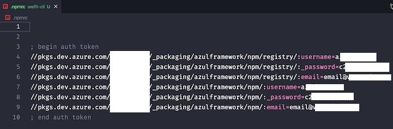
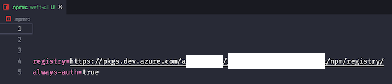

# WeFit CLI


Ferramenta desenvolvida pela WeFit para auxiliar nossos TechDesigners.

## Instalação

- Instalar no npm global com o seguinte comando:

```bash
npm install -g wefit-cli
```

- Testar a instalação chamando a CLI:

```bash
we
```


---

## Comandos

<details>
  <summary>
    <b>Ajuda</b>
  </summary>

  ### Ajuda

  Para verificar os possíveis comandos

  ```bash
  we -h
  ```

  
</details>

<details>
  <summary>
    <b>Tradução</b>
  </summary>

  ### Tradução

  Para rodar os comandos de tradução é preciso estar no mesmo nível da pasta locales

  - **translation-export**: Exporta os arquivos da pasta locales para xlsx
  - **translation-import**: Importa a planilha de tradução
</details>

<details>
  <summary>
    <b>Figma</b>
  </summary>

  ### Figma

  - **figma-generate**: Executa a exportação do DS e gera os arquivos no local da execução do comando:

  - /assets/icons/config.json

  ### Ao executar o comando abaixo você vai precisar inserir dois token prompt:

  ```bash
  we figma-generate # we fg
  ```

  - Token de usuário do Figma, que pode ser gerado aqui:
    
    

  - ID do arquivo do Figma, você pode pegar na url logo após o *www.figma.com/design/*
    

  ### Atualizando a lista de tipagem de nomes dos ícones

  Após executar a importação do figma e ter seu config.json atualizado é preciso seguir os seguintes passos:

  - Adicionar em seu `package.json` o script:

  ```
  "update:icon": "node caminho/para-o-arquivo/generateIconType.js"
  ```

  - Executar `npm run update:icon`

  Você encontra o script `generateIconType.js` e o componente React que renderiza ícones a partir do `icon/config.json` [aqui](./templates/Icon/)
</details>

<details>
  <summary>
    <b>Credencial Devops</b>
  </summary>

  ### Credencial Devops

  Para executar o comando de atualização de credencial, você pode estar em qualquer parte do sistema.

  - **set-git-credential**: Seta a nova credencial para o repositório

  ```bash
  we set-git-credential sua_nova_credencial # we sgc sua_nova_credencial
  ```

  A partir desse comando, será solicitado o _path_ do repositório que deverá ser atualizado e o que você quer fazer, executar o comando ou copiar para a área de transferência.

  
</details>

<details>
  <summary>
    <b>VS Code Extensions</b>
  </summary>

  ### VS Code Extensions

  - **vscode-extensions**: Instala as extensões para VS Code recomendadas pela WeFit.

  ```bash
  we vscode-extensions # we ve
  ```

  
</details>

<details>
  <summary>
    <b>Atualizar versão do projeto React Native</b>
  </summary>

  ### Atualizar versão do projeto React Native
  
  Este comando facilita a atualização da versão dos projetos react native nos ambientes nativos (Android e iOS) para mais informações sobre esse fluxo acesse a documentação em [link da doc](https://www.notion.so/WIP-Controle-de-vers-es-no-React-Native-19279887e7e54f99b468fbfb9aeb7ae3)

  
</details>

<details>
  <summary>
    <b>Criar ou atualizar o arquivo `.npmrc`</b>
  </summary>

  ### Criar ou atualizar o arquivo `.npmrc`
  
  Este comando facilita a criação do arquivo `.npmrc`, tanto na raiz da sua máquina quanto no local do repositório necessário. Caso você tenha dúvidas e queira mais informações, você pode ter mais informações acessando o [Storybook Azul](https://storybook-stg.voeazul.com.br/) ou [Storybook Hapvida](https://storybook-dev.hapvida.com.br/).

  - Executando o comando `we update-npmrc` será mostrado a informação necessária.

  ```bash
  we update-npmrc # we npmrc
  ```
  

  - Executando o comando `we update-npmrc -E email@azul.com -P senhaNormal` com o e-mail inválido.
  ```bash
  we update-npmrc -E email@azul.com -P senhaNormal # we npmrc -E email@azul.com -P senhaNormal
  ```
  

  - Executando o comando e escolhendo a 1ª opção.
  

  - Vendo o resultado da 1ª opção.
  

  - Executando o comando e escolhendo a 2ª opção.
  

  - Vendo o resultado da 2ª opção.
  

</details>

---

## Controle de Alterações com Changeset

Ao realizar alterações neste projeto, é necessário atualizar o arquivo `CHANGELOG.md` para isso utilize o comando

```bash
  npm run changeset
```

Este comando irá criar um arquivo dentro da pasta `.changeset` na raiz do projeto, neste arquivo devem ser listadas todas as alterações realizadas, e ao final deve ser executado o comando.

```bash
  npm run version-packages
```

Com esse comando a versão do projeto e o arquivo `CHANGELOG.md` são atualizados.

---

## Templates

Abaixo a lista de templates.

- [Componente de ícone icon/config.json - React](./templates/Icon/)

---

## Contribuidores

Agradecemos a todos que contribuíram para este projeto e tornaram a WeFit CLI ainda melhor!

Para conhecer um pouco mais dos colaboradores, consulte abaixo:

| [](https://github.com/fonseca-leonardo) | [](https://github.com/jerp86) | [](https://github.com/Bonassa) | [](https://github.com/limaCoder) | [](https://github.com/flammajl) | [](https://github.com/ViniciusPonte) | [](https://github.com/TiagoGP-exe) |
| --- | --- | --- | --- | --- | --- | --- |

**Quer contribuir?**

Sinta-se à vontade para abrir um pull request! :)
